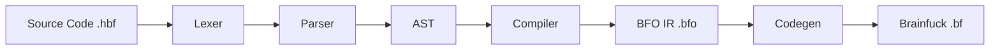

# HBF Compiler Architecture

The compiler follows a standard multi-stage pipeline design.

## Pipeline Overview

## 1. Lexer (`src/lexer.rs`)
Converts raw text into a stream of `Token`s.
- Skips whitespace and comments.
- Identifies keywords (`let`, `print`, `while`), numbers, strings, and operators.

## 2. Parser (`src/parser.rs`)
Consumes tokens and constructs an **Abstract Syntax Tree (AST)**.
- **Statement Nodes**: `Let`, `Assign`, `Print`, `While`.
- **Expression Nodes**: `Number`, `Variable`, `BinaryOperation`.

## 3. Compiler (`src/compiler.rs`) - lowering to IR
This stage translates the high-level AST into **Brainfuck Objects (BFO)**, an intermediate representation.
- **Memory Management**: Maintains a symbol table (`name` -> `cell_index`) and a pointer to the next free cell.
- **Instruction Generation**: Emits operations like `Add(n)`, `MoveRight(n)`, `Clear`.
- **Logic**: Handles the complexity of moving data between cells (since BF can't "copy" natively without a temp cell).

### The BFO IR (`src/ir.rs`)
BFO abstracts away the repetition of BF commands.
- `Add(u8)`: Instead of `+++++`, we have `Add(5)`.
- `MoveRight(usize)`: instead of `>>>>>`, we have `MoveRight(5)`.
- `Loop(Vec<BFO>)`: Nested structure for loops.

## 4. Codegen (`src/codegen.rs`)
The final stage expands BFO instructions into raw Brainfuck characters.
- `BFO::Add(3)` -> `+++`
- `BFO::Clear` -> `[-]`
