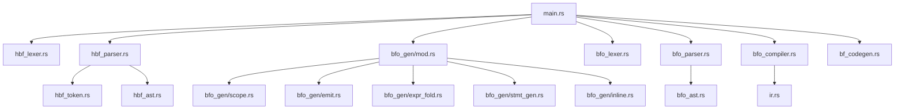

# HBF Compiler Architecture

The HBF compiler follows a multi-stage pipeline design with clear separation of concerns across frontend, optimization, and backend stages.

## High-Level Pipeline


## Component Overview

### Frontend: HBF → BFO

The frontend transforms high-level HBF code into optimized BFO intermediate representation.

#### 1. HBF Lexer (`src/hbf_lexer.rs`)
**Responsibility**: Tokenization

Converts raw source text into a stream of tokens:
- Keywords: `int`, `cell`, `void`, `for`, `while`, `if`, `forn`
- Identifiers: Variable and function names
- Literals: Numbers, characters, strings, booleans
- Operators: `+`, `-`, `*`, `/`, `==`, `!=`, `&&`, `||`, etc.
- Delimiters: `{`, `}`, `(`, `)`, `[`, `]`, `;`, `,`

**Key Features**:
- Handles escape sequences in strings (`\n`, `\t`)
- Supports single-line (`//`) and multi-line (`/* */`) comments
- Tracks line numbers for error reporting

#### 2. HBF Parser (`src/hbf_parser.rs`)
**Responsibility**: Syntax Analysis

Constructs an Abstract Syntax Tree (AST) from the token stream:
- **Expressions**: Binary operations, function calls, array access, member access
- **Statements**: Variable declarations, assignments, control flow, I/O
- **Declarations**: Functions, global variables

**Parsing Strategy**:
- Recursive descent parser
- Operator precedence handling for expressions
- Lookahead for disambiguating statements

#### 3. HBF AST (`src/hbf_ast.rs`)
**Responsibility**: AST Definitions

Defines the data structures representing HBF programs:

```rust
pub enum Type {
    Int,        // Virtual
    Char,       // Virtual
    Bool,       // Virtual
    Cell,       // Physical
    Array(Box<Type>),
    Void,
}

pub enum Expr {
    Number(i32),
    CharLiteral(char),
    BoolLiteral(bool),
    StringLiteral(String),
    Variable(String),
    BinaryOp { left, op, right },
    ArrayAccess { array, index },
    MemberAccess { object, member },
    FunctionCall { name, args },
    // ...
}

pub enum Stmt {
    VarDecl { var_type, name, value },
    Assign { name, value },
    For { init, condition, update, body },
    While { condition, body },
    If { condition, then_branch, else_branch },
    Putc(Expr),
    FuncDecl { name, params, return_type, body },
    // ...
}
```

#### 4. BFO Generator (`src/bfo_gen/`)
**Responsibility**: Optimization & Code Generation

The BFO generator is the heart of the compiler, performing aggressive optimizations while generating BFO code. It has been **modularized into 6 focused files**:

##### Module Structure

```
src/bfo_gen/
├── mod.rs (48 lines)
│   ├── BFOGenerator struct definition
│   ├── Public API: new(), generate()
│   └── Module declarations
│
├── scope.rs (47 lines)
│   ├── push_scope() / pop_scope()
│   ├── get_variable() / declare_variable() / set_variable()
│   └── get_array_var_name()
│
├── emit.rs (168 lines)
│   ├── emit() / emit_line() / indent()
│   ├── emit_set() / emit_new() / emit_add() / emit_sub()
│   ├── materialize_to_cell() - Converts expressions to BFO cells
│   └── free_cell()
│
├── expr_fold.rs (120 lines)
│   └── fold_expr() - Constant folding & evaluation
│       ├── Evaluates arithmetic at compile-time
│       ├── Resolves array indexing for virtual arrays
│       └── Folds member access (.length)
│
├── stmt_gen.rs (520 lines)
│   ├── gen_stmt() - Main statement generation
│   │   ├── Handles all statement types
│   │   ├── Loop unrolling for constant bounds
│   │   └── Compile-time if/else evaluation
│   ├── gen_expr() - Expression code generation
│   └── gen_expr_simple() - Simple expression emission
│
└── inline.rs (52 lines)
    └── inline_function() - Function inlining logic
        ├── Evaluates arguments in caller scope
        ├── Creates new scope for function body
        └── Generates BFO block with parameters
```

##### Key Algorithms

**Constant Folding** (`expr_fold.rs`):
```rust
// Input: 5 + 10
// Output: Expr::Number(15)
```

**Loop Unrolling** (`stmt_gen.rs`):
```rust
// Input: for (int i = 0; i < 3; i++) { putc('A'); }
// Output: print 'A'
//         print 'A'
//         print 'A'
```

**Function Inlining** (`inline.rs`):
```rust
// Input: void f(int x) { putc(x + 48); } f(5);
// Output: print 53  // Evaluated 5 + 48 at call site
```

**Variable Management** (`scope.rs`):
- Maintains stack of scopes for virtual variables
- Tracks physical cells and arrays
- Handles variable shadowing correctly

### Middle-End: BFO Format

BFO (Brainfuck Object) is a human-readable, assembly-like intermediate representation.

#### BFO Instructions

| Instruction | Description | Example |
|-------------|-------------|---------|
| `new <var> <val>` | Create and initialize variable | `new x 10` |
| `set <var> <val>` | Set variable to value | `set x 5` |
| `add <var> <val>` | Add to variable | `add x 3` |
| `sub <var> <val>` | Subtract from variable | `sub x 1` |
| `print <val>` | Output character | `print 'A'` |
| `while <var> { }` | Loop while non-zero | `while x { ... }` |
| `{ }` | Block scope | `{ new x 5; }` |
| `free <var>` | Free variable | `free x` |

### Backend: BFO → Brainfuck

The backend compiles BFO to executable Brainfuck code.

#### 5. BFO Lexer (`src/bfo_lexer.rs`)
**Responsibility**: BFO Tokenization

Tokenizes BFO instructions into a structured format.

#### 6. BFO Parser (`src/bfo_parser.rs`)
**Responsibility**: BFO AST Construction

Parses BFO tokens into an AST for compilation.

#### 7. BFO Compiler (`src/bfo_compiler.rs`)
**Responsibility**: Memory Management & IR Generation

- **Cell Allocation**: Assigns tape positions to variables
- **Scope Management**: Handles block scopes with `enter_scope()` / `exit_scope()`
- **Pointer Tracking**: Maintains current tape position
- **IR Generation**: Converts BFO instructions to internal IR

**Key Features**:
- Stack-based scope management
- Cell reuse within scopes
- Efficient pointer movement

#### 8. Internal IR (`src/ir.rs`)
**Responsibility**: Brainfuck Abstraction

Defines high-level Brainfuck operations:
```rust
pub enum BFOp {
    Add(u8),           // +++ -> Add(3)
    Sub(u8),           // --- -> Sub(3)
    MoveRight(usize),  // >>> -> MoveRight(3)
    MoveLeft(usize),   // <<< -> MoveLeft(3)
    Loop(Vec<BFOp>),   // [...] -> Loop(...)
    Input,             // ,
    Output,            // .
}
```

#### 9. Brainfuck Codegen (`src/bf_codegen.rs`)
**Responsibility**: Final Code Generation

Expands IR operations into raw Brainfuck characters:
- `Add(3)` → `+++`
- `MoveRight(2)` → `>>`
- `Loop([Output])` → `[.]`

## Data Flow Example

**HBF Source:**
```c
int a = 5;
cell c = a + 10;
putc(c);
```

**After Parsing (AST):**
```
Program {
  statements: [
    VarDecl { type: Int, name: "a", value: Number(5) },
    VarDecl { type: Cell, name: "c", value: BinaryOp(Variable("a"), Plus, Number(10)) },
    Putc(Variable("c"))
  ]
}
```

**After BFO Generation:**
```
new c 15
print c
```

**After BFO Compilation (IR):**
```
[
  Add(15),    // Set cell to 15
  Output,     // Print cell
]
```

**Final Brainfuck:**
```
+++++++++++++++.
```

## Optimization Passes

### 1. Virtual Variable Elimination
- `int` and `char` variables never materialize to BFO
- Only used for compile-time computation

### 2. Constant Folding
- Evaluates arithmetic at compile-time
- Resolves array indexing for literals

### 3. Loop Unrolling
- Unrolls `for` loops with constant bounds
- Eliminates loop overhead entirely

### 4. Function Inlining
- Inlines functions with virtual parameters
- Enables cross-function constant folding

### 5. Dead Code Elimination
- Removes unused virtual variables
- Eliminates unreachable branches in `if/else`

## Module Dependencies



## Performance Characteristics

| Stage | Complexity | Notes |
|-------|-----------|-------|
| Lexing | O(n) | Linear scan of source |
| Parsing | O(n) | Single-pass recursive descent |
| BFO Generation | O(n) | AST traversal with constant folding |
| BFO Compilation | O(n) | Linear IR generation |
| Codegen | O(n) | IR expansion |

**Overall**: O(n) where n is the source code size

## Error Handling

- **Lexer**: Reports invalid characters and malformed literals
- **Parser**: Provides syntax error messages with line numbers
- **BFO Generator**: Panics on type mismatches and undefined variables
- **BFO Compiler**: Validates instruction sequences

## Future Architecture Improvements

1. **Type Checker**: Separate type checking pass before BFO generation
2. **Optimization IR**: Dedicated IR for optimization passes
3. **Backend Abstraction**: Support multiple Brainfuck variants
4. **Incremental Compilation**: Cache BFO for faster rebuilds
5. **Module System**: Support for multi-file projects
