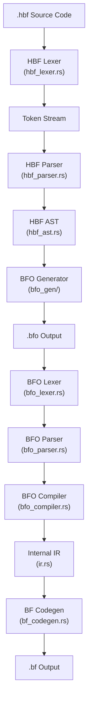

# HBF Compiler: Technical Internals

This document explains the internal implementation details of the HBF compiler, focusing on how source code is transformed into optimized Brainfuck code.

## Compilation Pipeline

The compiler follows a traditional multi-stage design with aggressive optimization:



## Core Modules

### 1. HBF Lexer (`src/hbf_lexer.rs`)

**Responsibility**: Tokenization of HBF source code

**Implementation**:
- Uses `Peekable<Chars>` iterator for lookahead
- Handles multi-character operators (`==`, `!=`, `&&`, `||`, `++`, `--`)
- Processes escape sequences in strings and characters
- Skips whitespace and comments

**Key Functions**:
```rust
pub fn tokenize(input: &str) -> Vec<Token>
```

**Token Types** (defined in `hbf_token.rs`):
- Keywords: `Int`, `Cell`, `Void`, `For`, `While`, `If`, `Forn`, etc.
- Literals: `Number(i32)`, `CharLiteral(char)`, `StringLiteral(String)`, `BoolLiteral(bool)`
- Operators: `Plus`, `Minus`, `Star`, `Slash`, `DoubleEquals`, etc.
- Delimiters: `LeftBrace`, `RightBrace`, `LeftParen`, etc.

### 2. HBF AST (`src/hbf_ast.rs`)

**Responsibility**: Define data structures for program representation

**Key Types**:

```rust
pub enum Type {
    Int,                    // Virtual type
    Char,                   // Virtual type
    Bool,                   // Virtual type
    Cell,                   // Physical type
    Array(Box<Type>),       // Array of any type
    Void,                   // Function return type
}

impl Type {
    pub fn is_virtual(&self) -> bool {
        matches!(self, Type::Int | Type::Char | Type::Bool)
    }
}
```

**Expression Types**:
- `Number(i32)` - Integer literals
- `CharLiteral(char)` - Character literals
- `BoolLiteral(bool)` - Boolean literals (`true`/`false`)
- `StringLiteral(String)` - String literals (converted to `char[]`)
- `Variable(String)` - Variable references
- `BinaryOp { left, op, right }` - Arithmetic/logical operations
- `ArrayAccess { array, index }` - Array indexing
- `MemberAccess { object, member }` - Property access (`.length`)
- `FunctionCall { name, args }` - Function invocation
- `ArrayLiteral(Vec<Expr>)` - Array initialization

**Statement Types**:
- `VarDecl { var_type, name, value }` - Variable declaration
- `Assign { name, value }` - Assignment
- `IndexedAssign { name, index, value }` - Array element assignment
- `For { init, condition, update, body }` - For loop
- `Forn { count, body }` - Native countdown loop
- `While { condition, body }` - While loop
- `If { condition, then_branch, else_branch }` - Conditional
- `Putc(Expr)` - Output expression
- `FuncDecl { name, params, return_type, body }` - Function declaration
- `ExprStmt(Expr)` - Expression statement (function call)
- `Group(Vec<Stmt>)` - Statement block

### 3. HBF Parser (`src/hbf_parser.rs`)

**Responsibility**: Build AST from token stream

**Implementation**:
- Recursive descent parser
- Operator precedence climbing for expressions
- Unified post-fix operator handling (`a++` is immediately parsed as an assignment `a = a + 1`)
- Lookahead for statement disambiguation

**Key Parsing Functions**:
```rust
fn parse_program(&mut self) -> Program
fn parse_statement(&mut self) -> Stmt
fn parse_expression(&mut self) -> Expr
fn parse_type(&mut self) -> Type
```

**Statement Disambiguation**:
The parser handles ambiguous cases like:
```c
foo();      // Function call (ExprStmt)
foo = 5;    // Assignment
```

By parsing the identifier as an expression first, then checking for `=`.

### 4. BFO Generator (`src/bfo_gen/`)

**Responsibility**: The core optimization and code generation engine

The BFO generator has been **refactored into 6 focused modules** for better maintainability:

#### Module: `mod.rs` (48 lines)

**Responsibility**: Main struct and public API

```rust
pub struct BFOGenerator {
    pub(super) output: String,                          // Generated BFO code
    pub(super) functions: HashMap<String, Stmt>,        // Function definitions
    pub(super) arrays: HashMap<String, (usize, usize, Type, Option<Vec<Expr>>)>,
    pub(super) variables: Vec<HashMap<String, Expr>>,   // Scope stack
    pub(super) indent_level: usize,
    pub(super) forn_counter: usize,
    pub(super) native_loop_depth: usize,
}

impl BFOGenerator {
    pub fn new() -> Self { ... }
    pub fn generate(&mut self, program: Program) -> String { ... }
}
```

**Public API**:
- `new()` - Create new generator
- `generate(program)` - Generate BFO from AST

#### Module: `scope.rs` (47 lines)

**Responsibility**: Variable scope management

**Key Functions**:
```rust
fn push_scope(&mut self)                           // Enter new scope
fn pop_scope(&mut self)                            // Exit scope
fn get_variable(&self, name: &str) -> Option<Expr> // Lookup variable
fn declare_variable(&mut self, name: &str, val: Expr) // Declare in current scope
fn set_variable(&mut self, name: &str, val: Expr)  // Update existing variable
fn get_array_var_name(&self, name: &str, index: i32) -> String // Get cell name
```

**Scope Stack**:
- `variables: Vec<HashMap<String, Expr>>` - Stack of scopes
- Searches from innermost to outermost scope
- Supports variable shadowing

**Critical Bug Fix**:
The `set_variable` function previously had a variable shadowing bug:
```rust
// BEFORE (buggy):
for scope in self.variables.iter_mut().rev() {
    if let Some(val) = scope.get_mut(name) {  // 'val' shadows parameter!
        *val = val.clone();  // Assigns old value to itself
    }
}

// AFTER (fixed):
for scope in self.variables.iter_mut().rev() {
    if let Some(existing_val) = scope.get_mut(name) {
        *existing_val = val.clone();  // Correctly updates
        return;
    }
}
```

#### Module: `emit.rs` (168 lines)

**Responsibility**: BFO code emission helpers

**Key Functions**:
```rust
fn emit(&mut self, s: &str)                        // Append to output
fn emit_line(&mut self, s: &str)                   // Append line
fn indent(&mut self)                               // Emit indentation
fn emit_set(&mut self, name: &str, val: &str)      // Emit 'set' instruction
fn emit_new(&mut self, name: &str, val: &str)      // Emit 'new' instruction
fn emit_add(&mut self, name: &str, val: &str)      // Emit 'add' instruction
fn emit_sub(&mut self, name: &str, val: &str)      // Emit 'sub' instruction
fn free_cell(&mut self, name: &str)                // Emit 'free' instruction
```

**Materialization**:
```rust
fn materialize_to_cell(&mut self, name: &str, expr: Expr, is_new: bool)
```

Converts expressions to BFO cell operations:
- Literals → Direct `set`/`new`
- Variables → Copy pattern (`set x 0; add x y`)
- Binary ops → Optimized patterns (`A = A + B` → `add A B`)

**Optimization Patterns**:
- `A = A + B` → `add A B` (atomic update)
- `A = B + A` → `add A B` (commutative)
- `A = A - B` → `sub A B` (atomic update)

#### Module: `expr_fold.rs` (120 lines)

**Responsibility**: Constant folding and expression evaluation

**Key Function**:
```rust
fn fold_expr(&self, expr: Expr) -> Expr
```

**Folding Rules**:

1. **Variable Substitution**:
   ```rust
   Expr::Variable(name) => self.get_variable(&name).unwrap_or(Expr::Variable(name))
   ```

2. **Arithmetic Evaluation**:
   ```rust
   // 5 + 10 → 15
   Expr::BinaryOp { left: Number(5), op: Plus, right: Number(10) }
     → Expr::Number(15)
   ```

3. **Array Indexing**:
   ```rust
   // "Hello"[0] → 'H'
   Expr::ArrayAccess { array: StringLiteral("Hello"), index: Number(0) }
     → Expr::CharLiteral('H')
   ```

4. **Member Access**:
   ```rust
   // "Hello".length → 5
   Expr::MemberAccess { object: StringLiteral("Hello"), member: "length" }
     → Expr::Number(5)
   ```

**Supported Operations**:
- Arithmetic: `+`, `-`, `*`, `/`, `%`
- Comparison: `==`, `!=`, `<`, `<=`, `>`, `>=`
- Logical: `&&`, `||`

#### Module: `stmt_gen.rs` (520 lines)

**Responsibility**: Statement code generation

**Key Functions**:
```rust
fn gen_stmt(&mut self, stmt: Stmt, is_top_level: bool)
fn gen_expr(&mut self, expr: Expr)
fn gen_expr_simple(&mut self, expr: Expr)
```

**Statement Generation**:

1. **Variable Declaration**:
   - Virtual types → Store in scope stack
   - Physical types → Emit `new` instruction

2. **Assignment**:
   - Virtual → Update scope stack
   - Physical → Emit `set`/`add` instructions

3. **For/While Loops** (Unrolling):
   ```rust
   // For For loops with constant bounds or While loops with virtual conditions
   while iterations < 10000 && !loop_finished {
       // Evaluate condition
       if !is_truthy(self.fold_expr(condition)) { break; }
       for stmt in &body {
           self.gen_stmt(stmt.clone(), false);
       }
       // ... for-update ...
   }
   ```

4. **Forn Loops** (Native):
   ```rust
   // Generate countdown pattern
   self.materialize_to_cell(&counter, count, true);
   self.emit_line(&format!("while {} {{", counter));
   // ... body ...
   self.emit_sub(&counter, "1");
   self.emit_line("}");
   ```

5. **If/Else**:
   - Compile-time evaluation when possible
   - Runtime if using single-execution while loop pattern

6. **Putc**:
   - Literals → Direct `print`
   - Variables → `print <var>`
   - Expressions → Materialize to temp cell

#### Module: `inline.rs` (52 lines)

**Responsibility**: Function inlining

**Key Function**:
```rust
fn inline_function(&mut self, params: Vec<(Type, String)>, 
                   args: Vec<Expr>, body: Vec<Stmt>)
```

**Inlining Process**:

1. **Evaluate Arguments** (in caller scope):
   ```rust
   let evaluated_args: Vec<Expr> = args.iter()
       .map(|arg| self.fold_expr(arg.clone()))
       .collect();
   ```

2. **Create New Scope**:
   ```rust
   self.push_scope();
   self.emit_line("{");  // BFO block scope
   ```

3. **Initialize Parameters**:
   - Physical (`cell`) → Emit `new` instruction
   - Virtual → Store in scope

4. **Generate Body**:
   ```rust
   for stmt in body {
       self.gen_stmt(stmt, false);
   }
   ```

5. **Clean Up**:
   ```rust
   self.emit_line("}");
   self.pop_scope();
   ```

### 5. BFO Compiler (`src/bfo_compiler.rs`)

**Responsibility**: Compile BFO to internal IR

**Key Data Structures**:
```rust
struct BFOCompiler {
    cells: HashMap<String, usize>,      // Variable → tape position
    next_cell: usize,                   // Next free cell
    current_pos: usize,                 // Current tape pointer
    scopes: Vec<HashMap<String, usize>>, // Scope stack
}
```

**Compilation Process**:
1. Parse BFO instructions
2. Allocate tape cells for variables
3. Track pointer position
4. Generate pointer movement instructions
5. Emit cell manipulation operations

### 6. Brainfuck Codegen (`src/bf_codegen.rs`)

**Responsibility**: Generate final Brainfuck code

**IR to BF Mapping**:
```rust
BFOp::Add(n) → "+".repeat(n)
BFOp::Sub(n) → "-".repeat(n)
BFOp::MoveRight(n) → ">".repeat(n)
BFOp::MoveLeft(n) → "<".repeat(n)
BFOp::Loop(ops) → "[" + codegen(ops) + "]"
BFOp::Output → "."
BFOp::Input → ","
```

## Critical Implementation Details

### Loop Unrolling Logic (For and While)

Located in `stmt_gen.rs`:

```rust
// Unified unrolling for For and While
let mut iterations = 0;
while iterations < 10000 {
    let cond_val = if let Some(cond) = &condition {
        self.fold_expr(cond.clone()).is_truthy()
    } else { true };
    
    if !cond_val { break; }
    // ... generate body ...
    iterations += 1;
}
```

### Native Loop Depth Tracking

The compiler tracks `native_loop_depth` to warn about modifying virtual variables inside native loops:

```rust
self.native_loop_depth += 1;
// ... loop body ...
self.native_loop_depth -= 1;

// In set_variable:
if self.native_loop_depth > 0 {
    eprintln!("WARNING: Modifying virtual variable inside native loop");
}
```

## Performance Optimizations

1. **Single-Pass Compilation**: No separate optimization passes
2. **Inline Constant Folding**: Expressions evaluated during traversal
3. **Scope Stack**: O(1) variable lookup in most cases
4. **String Building**: Efficient `String` concatenation for output

## Testing Strategy

- **Unit Tests**: Individual module functions
- **Integration Tests**: End-to-end compilation
- **Example Programs**: Comprehensive test suite in `examples/`

## Debugging Tips

1. **View BFO Output**: Use `cargo run -- compile file.hbf` to see intermediate representation
2. **Add Debug Prints**: Temporary `println!` in generator modules
3. **Check Scope Stack**: Print `self.variables` to debug variable resolution
4. **Trace Folding**: Log `fold_expr` inputs and outputs

## Future Improvements

1. **Separate Type Checker**: Validate types before code generation
2. **Error Recovery**: Continue compilation after errors
3. **Better Diagnostics**: More helpful error messages with context
4. **Optimization Metrics**: Track optimization effectiveness
5. **Profiling**: Identify compilation bottlenecks
