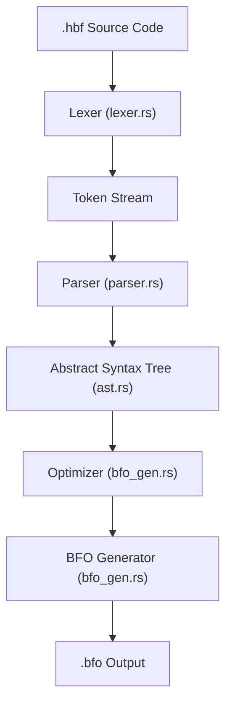

# HBF Compiler: Technical Internals

This document explains the internal architecture and code structure of the HBF (Higher Brainfuck) compiler to help developers understand how source code is transformed into Brainfuck Object (BFO) code.

## Compilation Pipeline

The compiler follows a traditional frontend/backend design:



## Core Modules

### 1. Lexer (`src/lexer.rs`)
- **Responsibility**: Converts raw source text into a stream of meaningful `Token`s (keywords, identifiers, numbers, operators).
- **Key Logic**: Uses a `Peekable<Chars>` iterator to scan the input. It matches patterns for strings, characters, and complex operators like `++`.

### 2. AST (`src/ast.rs`)
- **Responsibility**: Defines the data structures that represent the program's logic.
- **`Expr`**: Represents computations (Binary operations, variables, literals, function calls).
- **`Stmt`**: Represents actions (Variable declarations, assignments, `for`, `forn`, `while`, `putc`).

### 3. Parser (`src/parser.rs`)
- **Responsibility**: Consumes tokens and builds the AST.
- **Top-Level**: Recognizes function declarations and top-level statements (like global variable declarations or `putc`).
- **Function Parsing**: Parses parameters and the list of statements in the function body.

### 4. BFO Generator (`src/bfo_gen.rs`)
- **Responsibility**: The heart of the compiler. It lowers the high-level AST into flattened, assembly-like BFO instructions.
- **Optimization Phase**: Before generation, it runs `optimize_program` which:
  - Performs **Constant Folding**: Evaluates expressions like `5 + 10` at compile time.
  - Performs **Dead Variable Elimination**: Removes `int` variables that are only used to calculate other constants.
- **Generation Phase**: Recursively visits AST nodes and emits string-based BFO commands like `set`, `add`, `sub`, and `print`.

---

## Key Feature Implementations

### forn Loops (Native Countdown)
Implementation located in `parser.rs` (`parse_forn`) and `bfo_gen.rs`.
- **Logic**: It creates a countdown variable in BFO.
- **BFO Pattern**:
  ```
  set {var} {count}
  while {var} {
      {body}
      sub {var} 1
  }
  ```

### for Loops (Unrolling)
Implementation located in `bfo_gen.rs` (`gen_stmt`).
- **Logic**: The generator checks if a `for` loop has constant bounds (e.g., `i < 5`).
- **Unrolling**: Instead of emitting a loop in BFO, it simply emits the body instructions `N` times.
- **Benefit**: Zero runtime overhead for small, fixed loops in Brainfuck.

---

## Critical Logic: The "Identifier" Peek
In HBF, a statement can start with an identifier (e.g., `my_function();` or `my_var = 10;`). 
The parser (`parser.rs:154`) handles this by:
1. Parsing the first part as an expression.
2. Checking if the *next* token is an `=` (Assignment).
3. If it's NOT an `=`, it treats the expression as a statement (typically a function call).

This design ensures the compiler can distinguish between setting a value and calling a function without needing a complex lookahead in the lexer.
